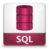
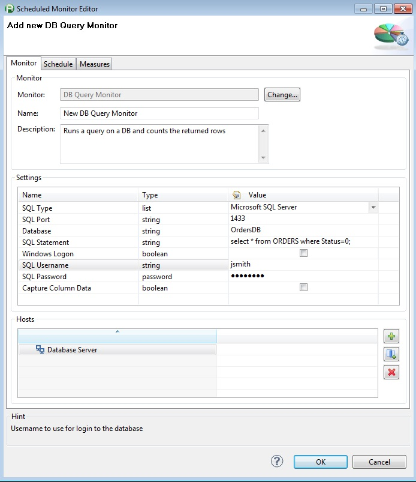

# DB Query Monitor Plugin

## Overview

The monitor returns the row count from the specified query and up to 10 column values of the "top" row if desired (must be numeric value). There is also an additional measure detailing whether the
connection to the database was successful or not

## Plugin Details

| Plug-In Versions | [DB Query Monitor Plugin 2.0.0](com.db.tabmon_2.0.0.jar) (compatible with dynaTrace 4.2+)
| :--- | :---
| |[DB Query Monitor Plugin 3.1.0](com.db.tabmon_3.1.0.jar) (tested with 5.5)
| |[DB Query Monitor Plugin 3.2.0](com.db.tabmon_3.2.0.jar) (added support for Ingres 9.x and Ingres 10.x - tested with dT 5.5)
| Author |Derek Abing (v 2.0.0)
| |James Mackin (v.3.0.0+)
| License |[dynaTrace BSD](dynaTraceBSD.txt)
| Support | [Not Supported ](https://community.compuwareapm.com/community/display/DL/Support+Levels#SupportLevels-Community) If you have any questions or suggestions for these plugins, please add a comment to this page, use our           [forum](https://community.dynatrace.com/community/pages/viewpage.action?pageId=46628918), or drop us an email at [apmcommunity@compuware.com](mailto:apmcommunity@compuware.com)!
| Known Problems |
| Release History | 2013-05-23 Initial Release by Derek Abing
| |2013-09-16 Version 3.0.0 provided by James Mackin now provides up to 10 result columns
| |2013-09-23 Version 3.1.0 provided by James Mackin with addition configuration options and result measures
| | 2013-10-19 Version 3.2.0 provided by Steve Caron with support for Ingres 9.x & 10.x

## Configuration

Name

Value

SQL Type

Select if you want to query MSSQL, Oracle, or IBM DB2

SQL Port

SQL Port to use on the SQL Server

Database

Name of the database to connect to on the sql server

SQL Statement

SQL Statement to execute on the SQL database. The returned rows of this statement will be used for the monitor.

Windows Logon

If checked, the program will use windows single sign-on and use the credentials associated with the Collector.

SQL Username

Username to use for login to the database (SQL Server Authentication)

SQL Password

Password for the username used to connect to the sql database (SQL Server Authentication)

Capture Column Data

If this box is checked you can capture the value of the top row of a specific column. If this value is set, the query should ensure that the first record contains the pertinent data. The result set
should also only contain one record, unless the row count is also important to trac  k.

Query Timeout  (since v 3.0.0)

The query timeout period, in seconds. The query will be cancelled after this time and the total response time returned as a measure, which can then be alerted on

Query Name  (since v 3.0.0)

A readable short name used to identify the query in this monitor instance

Column Name  (since v 3.0.0)

The name of the first column whose value should be returned. The returned value must be numeric

Column Name 2  (since v 3.0.0)

The name of the second column whose value should be returned. The returned value must be numeric. If this column and any other subsequent columns are specified, then the values will be returned as
dynamic measures, scoped by the Query Name

Column Name 3 - 10  (since v 3.0.0)

The name of the 3rd - 10th columns whose values should be returned

Match Content (since v 3.1.0)

If this box is checked then two more configuration items become available to enter: a column name to compare against a constant value, and the constant value itself.

Match Column (since v 3.1.0)

The name of the column in the result set to match against

Match Value (since v 3.1.0)

The value, or regular expression, the column needs to be compared to. If the two values are equal the 'Content Verified' measure will be set to 1. Otherwise it will be set to 0.

*****WARNING - The datatype of the column must be numeric!***** 

## Measures

Column Value

The value of the captured column as a regular measure. Will contain the value of the first column returned, if the _Capture Column Data_ column is checked.

If multiple column names are specified, then this measure can be selected and then split the measures based on the specified Query Name property

DB Connection

Returns a 1 if the DB connection was successful and a 0 if the DB connection failed or if the query didn't finish within the Query Timeout number of seconds

Row Count

Number of rows returned in the query

Response Time (since v 3.0.0)

The total time, in milliseconds, that it took to connect to the database, execute the query, and close the database connection.

Connect Response Time  (since v 3.0.0)

The total time, in  milliseconds  , that it took to connect to the database.

Query Response Time  (since v 3.0.0)

The total time, in  milliseconds  , that it took to execute the query.

Content Verified (since v 3.1.0)

1 if the Match Content flag is checked, and the Match Value and the contents of the Match Column are equivalent.

## Installation

Import the Plugin into the dynaTrace Server. For details how to do this please refer to the [dynaTrace documentation](https://community.compuwareapm.com/community/display/DOCDT50/Manage+and+Develop+User+Plugins).

