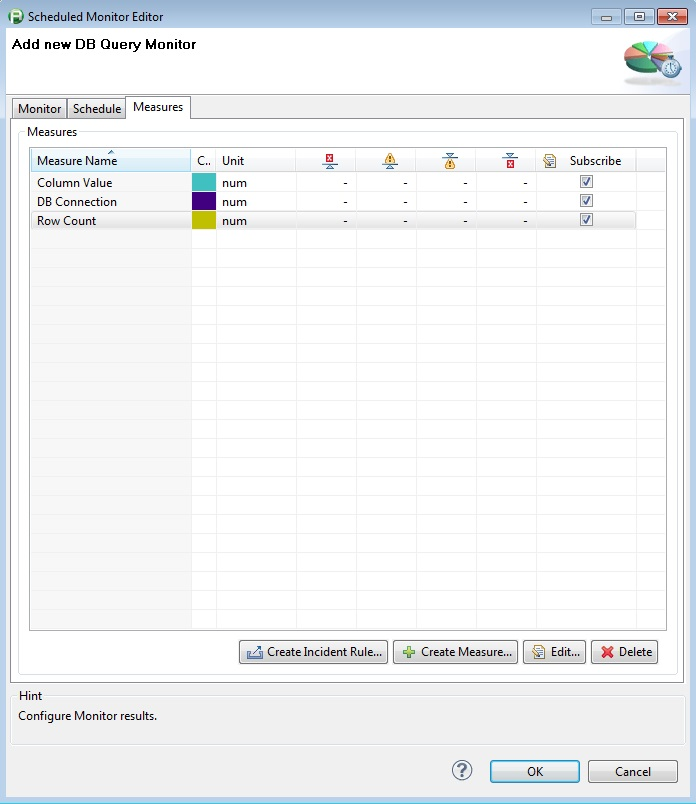
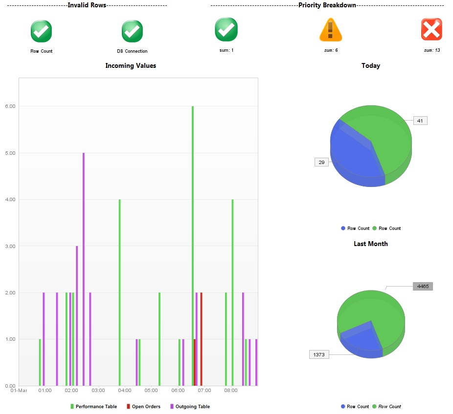

<html xmlns="http://www.w3.org/1999/xhtml">
<head>
    <title>DB Query Monitor Plugin</title>
    <meta http-equiv="Content-Type" content="text/html; charset=UTF-8"/>
    <meta http-equiv="X-UA-Compatible" content="IE=EmulateIE8" />
    <meta content="Scroll Wiki Publisher" name="generator"/>
    <link type="text/css" rel="stylesheet" href="css/blueprint/liquid.css" media="screen, projection"/>
    <link type="text/css" rel="stylesheet" href="css/blueprint/print.css" media="print"/>
    <link type="text/css" rel="stylesheet" href="css/content-style.css" media="screen, projection, print"/>
    <link type="text/css" rel="stylesheet" href="css/screen.css" media="screen, projection"/>
    <link type="text/css" rel="stylesheet" href="css/print.css" media="print"/>
</head>
<body>
                <h1>DB Query Monitor Plugin</h1>
    

        <h2>Overview</h2>
    

    

            
            

The monitor returns the row count from the specified query and up to 10 column values of the &quot;top&quot; row if desired (must be numeric value). There is also an additional measure detailing whether the connection to the database was successful or not    

    

    

    

        <table>
<thead class=" "></thead><tfoot class=" "></tfoot><tbody class=" ">    <tr>
            <td rowspan="1" colspan="1">
        

            
            

            </td>
                <td rowspan="1" colspan="1">
        

            
            

            </td>
                <td rowspan="1" colspan="1">
        

            
            

            </td>
        </tr>
    <tr>
            <td rowspan="1" colspan="1">
                </td>
                <td rowspan="1" colspan="1">
                </td>
                <td rowspan="1" colspan="1">
                </td>
        </tr>
</tbody>        </table>
            

    

    

    

    

        <h2>Plugin Details</h2>
    

        <table>
<thead class=" "></thead><tfoot class=" "></tfoot><tbody class=" ">    <tr>
            <td rowspan="1" colspan="1">
        

Plug-In Versions    

            </td>
                <td rowspan="1" colspan="1">
        

<a href="attachments_121569618_1_com.db.tabmon_2.0.0.jar">DB Query Monitor Plugin 2.0.0</a> (compatible with dynaTrace 4.2+)    

    

<a href="attachments_139657220_1_com.db.tabmon_3.1.0.jar">DB Query Monitor Plugin 3.1.0</a> (tested with 5.5)    

    

<a href="attachments_142541006_1_com.db.tabmon_3.2.0.jar">DB Query Monitor Plugin 3.2.0</a> (added support for Ingres 9.x and Ingres 10.x - tested with dT 5.5)    

            </td>
        </tr>
    <tr>
            <td rowspan="1" colspan="1">
        

Author    

            </td>
                <td rowspan="1" colspan="1">
        

Derek Abing (v 2.0.0)    

    

James Mackin (v.3.0.0+)    

            </td>
        </tr>
    <tr>
            <td rowspan="1" colspan="1">
        

License    

            </td>
                <td rowspan="1" colspan="1">
        

<a href="attachments_5275722_2_dynaTraceBSD.txt">dynaTrace BSD</a>    

            </td>
        </tr>
    <tr>
            <td rowspan="1" colspan="1">
        

Support    

            </td>
                <td rowspan="1" colspan="1">
        

<a href="https://community/display/DL/Support+Levels#SupportLevels-Community">Not Supported </a> If you have any questions or suggestions for these plugins, please add a comment to this page, use our <a href="https://community.dynatrace.com/community/pages/viewpage.action?pageId=46628918">forum</a>, or drop us an email at <a href="mailto:apmcommunity@compuware.com">apmcommunity@compuware.com</a>!    

            </td>
        </tr>
    <tr>
            <td rowspan="1" colspan="1">
        

Known Problems    

            </td>
                <td rowspan="1" colspan="1">
        

    

            </td>
        </tr>
    <tr>
            <td rowspan="1" colspan="1">
        

Release History    

            </td>
                <td rowspan="1" colspan="1">
        

2013-05-23 Initial Release by Derek Abing    

    

2013-09-16 Version 3.0.0 provided by James Mackin now provides up to 10 result columns    

    

2013-09-23 Version 3.1.0 provided by James Mackin with addition configuration options and result measures    

    

2013-10-19 Version 3.2.0 provided by Steve Caron with support for Ingres 9.x &amp; 10.x    

            </td>
        </tr>
    <tr>
            <td rowspan="1" colspan="1">
        

    

            </td>
                <td rowspan="1" colspan="1">
        

    

            </td>
        </tr>
</tbody>        </table>
            

    

    
    

        <h2>Configuration</h2>
    
    

        <table>
<thead class=" ">    <tr>
            <td rowspan="1" colspan="1">
        

Name    

            </td>
                <td rowspan="1" colspan="1">
        

Value    

            </td>
        </tr>
</thead><tfoot class=" "></tfoot><tbody class=" ">    <tr>
            <td rowspan="1" colspan="1">
        

SQL Type    

            </td>
                <td rowspan="1" colspan="1">
        

Select if you want to query MSSQL, Oracle, or IBM DB2    

            </td>
        </tr>
    <tr>
            <td rowspan="1" colspan="1">
        

SQL Port    

            </td>
                <td rowspan="1" colspan="1">
        

SQL Port to use on the SQL Server    

            </td>
        </tr>
    <tr>
            <td rowspan="1" colspan="1">
        

Database    

            </td>
                <td rowspan="1" colspan="1">
        

Name of the database to connect to on the sql server    

            </td>
        </tr>
    <tr>
            <td rowspan="1" colspan="1">
        

SQL Statement    

            </td>
                <td rowspan="1" colspan="1">
        

SQL Statement to execute on the SQL database. The returned rows of this statement will be used for the monitor.    

            </td>
        </tr>
    <tr>
            <td rowspan="1" colspan="1">
        

Windows Logon    

            </td>
                <td rowspan="1" colspan="1">
        

If checked, the program will use windows single sign-on and use the credentials associated with the Collector.    

            </td>
        </tr>
    <tr>
            <td rowspan="1" colspan="1">
        

SQL Username    

            </td>
                <td rowspan="1" colspan="1">
        

Username to use for login to the database (SQL Server Authentication)    

            </td>
        </tr>
    <tr>
            <td rowspan="1" colspan="1">
        

SQL Password    

            </td>
                <td rowspan="1" colspan="1">
        

Password for the username used to connect to the sql database (SQL Server Authentication)    

            </td>
        </tr>
    <tr>
            <td rowspan="1" colspan="1">
        

Capture Column Data    

            </td>
                <td rowspan="1" colspan="1">
        

    
If this box is checked you can capture the value of the top row of a specific column. If this value is set, the query should ensure that the first record contains the pertinent data. The result set should also only contain one record, unless the row count is also important to trac    
k.    

            </td>
        </tr>
    <tr>
            <td rowspan="1" colspan="1">
        

    
Query Timeout    
 (since v 3.0.0)    

            </td>
                <td rowspan="1" colspan="1">
        

    
The query timeout period, in seconds. The query will be cancelled after this time and the total response time returned as a measure, which can then be alerted on    
    

            </td>
        </tr>
    <tr>
            <td rowspan="1" colspan="1">
        

    
Query Name    
 (since v 3.0.0)    

            </td>
                <td rowspan="1" colspan="1">
        

    
A readable short name used to identify the query in this monitor instance    
    

            </td>
        </tr>
    <tr>
            <td rowspan="1" colspan="1">
        

    
Column Name    
 (since v 3.0.0)    

            </td>
                <td rowspan="1" colspan="1">
        

    
The name of the first column whose value should be returned. The returned value must be numeric    
    

            </td>
        </tr>
    <tr>
            <td rowspan="1" colspan="1">
        

    
Column Name 2    
 (since v 3.0.0)    

            </td>
                <td rowspan="1" colspan="1">
        

    
The name of the second column whose value should be returned. The returned value must be numeric. If this column and any other subsequent columns are specified, then the values will be returned as dynamic measures, scoped by the Query Name    
    

            </td>
        </tr>
    <tr>
            <td rowspan="1" colspan="1">
        

    
Column Name 3 - 10    
 (since v 3.0.0)    

            </td>
                <td rowspan="1" colspan="1">
        

    
The name of the 3rd - 10th columns whose values should be returned    
    

            </td>
        </tr>
    <tr>
            <td rowspan="1" colspan="1">
        

Match Content (since v 3.1.0)    

            </td>
                <td rowspan="1" colspan="1">
        

If this box is checked then two more configuration items become available to enter: a column name to compare against a constant value, and the constant value itself.    

            </td>
        </tr>
    <tr>
            <td rowspan="1" colspan="1">
        

Match Column (since v 3.1.0)    

            </td>
                <td rowspan="1" colspan="1">
        

The name of the column in the result set to match against    

            </td>
        </tr>
    <tr>
            <td rowspan="1" colspan="1">
        

Match Value (since v 3.1.0)    

            </td>
                <td rowspan="1" colspan="1">
        

The value, or regular expression, the column needs to be compared to. If the two values are equal the 'Content Verified' measure will be set to 1. Otherwise it will be set to 0.    

            </td>
        </tr>
</tbody>        </table>
            

    

    

    

***<strong class=" ">WARNING - The datatype of the column must be numeric!</strong>***    

    

    

        <h2>Measures</h2>
    

        <table>
<thead class=" "></thead><tfoot class=" "></tfoot><tbody class=" ">    <tr>
            <td rowspan="1" colspan="1">
        

Column Value    

            </td>
                <td rowspan="1" colspan="1">
        

The value of the captured column as a regular measure. Will contain the value of the first column returned, if the <i class=" ">Capture Column Data</i> column is checked.    

    

If multiple column names are specified, then this measure can be selected and then split the measures based on the specified Query Name property    

            </td>
        </tr>
    <tr>
            <td rowspan="1" colspan="1">
        

DB Connection    

            </td>
                <td rowspan="1" colspan="1">
        

    
Returns a 1 if the DB connection was successful and a 0 if the DB connection failed or if the query didn&rsquo;t finish within the Query Timeout number of seconds    
    

            </td>
        </tr>
    <tr>
            <td rowspan="1" colspan="1">
        

Row Count    

            </td>
                <td rowspan="1" colspan="1">
        

Number of rows returned in the query    

            </td>
        </tr>
    <tr>
            <td rowspan="1" colspan="1">
        

    
Response Time (since v 3.0.0)    
    

            </td>
                <td rowspan="1" colspan="1">
        

    
The total time, in milliseconds, that it took to connect to the database, execute the query, and close the database connection.    
    

            </td>
        </tr>
    <tr>
            <td rowspan="1" colspan="1">
        

    
Connect Response Time    
 (since v 3.0.0)    

            </td>
                <td rowspan="1" colspan="1">
        

    
The total time, in     
milliseconds    
, that it took to connect to the database.     
    

            </td>
        </tr>
    <tr>
            <td rowspan="1" colspan="1">
        

    
Query Response Time    
 (since v 3.0.0)    

            </td>
                <td rowspan="1" colspan="1">
        

    
The total time, in     
milliseconds    
, that it took to execute the query.     
    

            </td>
        </tr>
    <tr>
            <td rowspan="1" colspan="1">
        

Content Verified (since v 3.1.0)    

            </td>
                <td rowspan="1" colspan="1">
        

1 if the Match Content flag is checked, and the Match Value and the contents of the Match Column are equivalent.    

            </td>
        </tr>
</tbody>        </table>
            

    

    

        <h2>Installation</h2>
    

Import the Plugin into the dynaTrace Server. For details how to do this please refer to the <a href="https://community/display/DOCDT50/Manage+and+Develop+User+Plugins">dynaTrace documentation</a>.    

    

            

        

        

        

    

</body>
</html>
